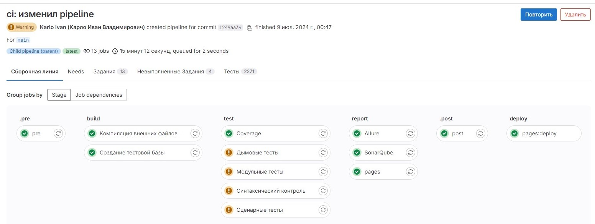
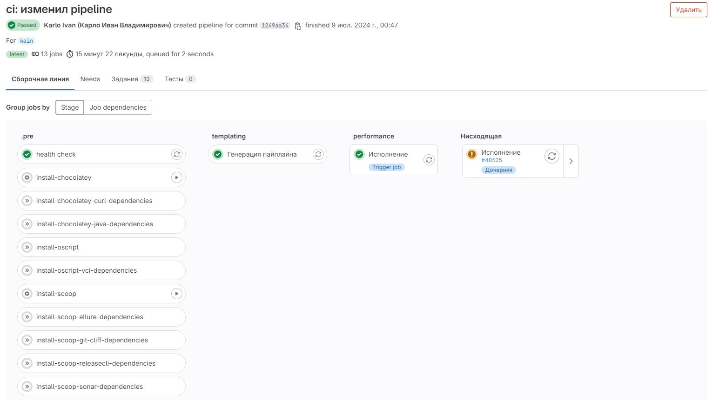
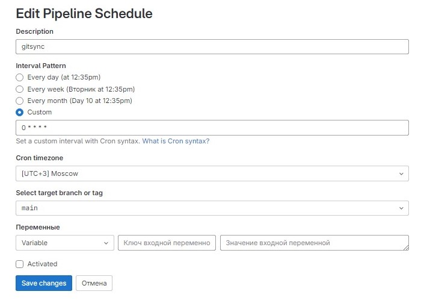
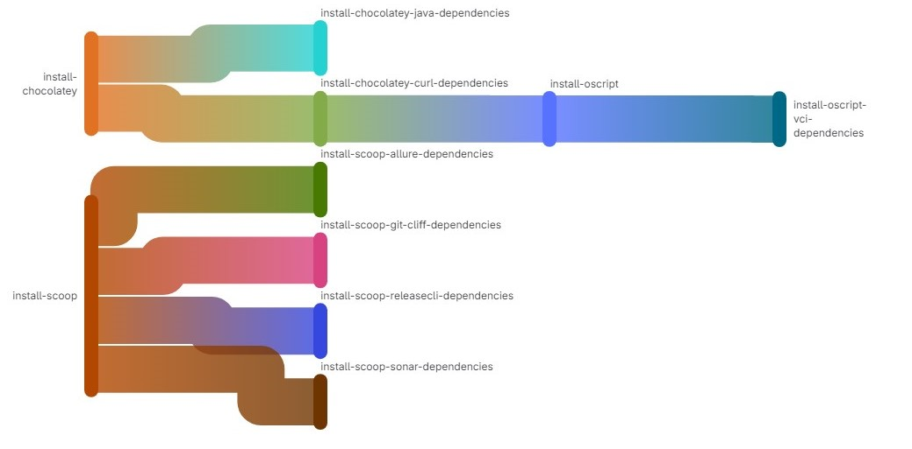
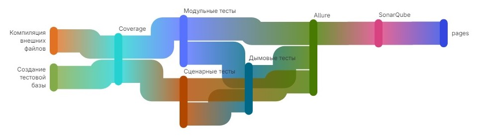
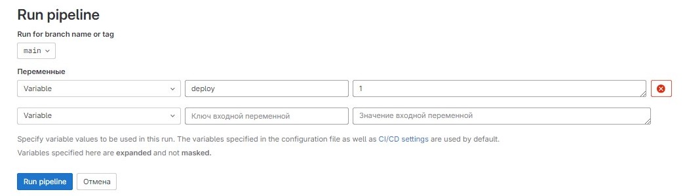
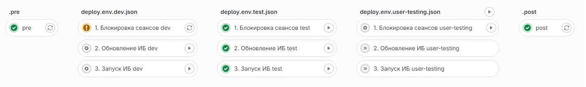

[DEPRECATED]

# vanessa-ci-scripts

- [vanessa-ci-scripts](#vanessa-ci-scripts)
  - [Введение](#введение)
    - [Файловая структура](#файловая-структура)
    - [Установка](#установка)
    - [Использование](#использование)
    - [Взаимосвязи заданий](#взаимосвязи-заданий)
      - [Шаг ".pre"](#шаг-pre)
    - [Шаг "deploy" для вашего проекта](#шаг-deploy-для-вашего-проекта)
      - [Настройка](#настройка)
      - [Выполнение](#выполнение)
    - [Доступные команды](#доступные-команды)
    - [Глобальные переменные окружения](#глобальные-переменные-окружения)
  - [Возможности доработки](#возможности-доработки)
  - [Публикация релиза](#публикация-релиза)
  - [Включение отладки](#включение-отладки)
  - [Благодарность](#благодарность)

## Введение

Набор скриптов Continuous Integration for 1C. Устанавливается как приложение OScript на компьютер с ролью Gitlab-runner.
Предназначена для быстрого перехода к использованию Gitlab pipeline.

Все требуемые библиотеки и приложения уже есть внутри VCI, по этому для работы pipeline достаточно выполнить установку приложения, чтобы gitsync, vanessa runner etc. выполнялись на runner.

**parent**:

**child**:


Проект опирается на структуру каталогов и файлов настроек из проектов:

- [vanessa-opensource/vanessa-bootstrap](https://github.com/vanessa-opensource/vanessa-bootstrap)
- [vanessa-opensource/vanessa-runner](https://github.com/vanessa-opensource/vanessa-runner)
- [vanessa-opensource/add](https://github.com/vanessa-opensource/add)

**Важно! Если ваш проект отличается от описанных шаблонов, то pipeline выполнится с ошибками.**

### Файловая структура

```shell
├── .vscode/                            # Полезные команды и настройки для VSC
    ├── settings.json
    ├── tasks.json
├── build/                              # * Каталог с артефактами
    ├── allure-report/                  # Сгенерированный отчет allure framework
    ├── cfe/
    ├── epf/
    ├── erf/
    ├── ib/
    ├── 1Cv8.cf
├── coverage/                           # * Каталог с результатами замеров покрытия кода
├── doc/                                # Документация
├── examples/                           # Примеры тестов, скриптов или обработок
├── features/                           # Сценарии BDD тестирования 
├── fixtures/                           # Основные зависимости
├── lib/                                # Для хранения внешних отчетов и обработок необходимых для работы продукта, разработанные в рамках создания продукта и не являющиеся сторонними разработками
├── out/                                # * Каталог с артефактами выполнения тестов
├── public/                             # * Каталог для работы GitLab pages
├── src/                                # Исходный код проекта
    ├── cf/                             # Код из конфигурации
    ├── cfe/                            # Код из расширений
        ├── <имя расширения>            # 
    ├── epf/                            # Внешние обработки
    ├── erf/                            # Внешние отчеты
├── tasks/                              # Основные таски (opm run <имя-скрипта>)
├── template/                           # Эталонные файлы
    ├── 1Cv8.dt                         # Выгрузка эталонной ИБ для тестов
├── tests/                              # Модульные тесты (TDD)
└── tools/                              # 
    ├── JSON/                           # Файлы настроек для runner'ов etc
        ├── vanessabddConf.json         # Настройки vanessa add (BDD, vanessa)
        ├── vanessatddConf.json         # Настройки vanessa add (TDD, xunit)
        ├── vaparams.json               # Настройки vanessa automation (BDD, vanessa)
    ├── scripts/                        # Служебные и пользовательские скрипты
        ├── install-oscript-local.bat   # Скрипт установки OScript
    └── syntax-check-excludes.txt       # Настройки исключений для синтаксического контроля
├── vendor/                             # Для хранения внешних зависимостей - библиотек, конфигураций etc
├── .gitlab-ci.yml                      # Конфигурационный файл для gitlab pipeline
├── cliff.toml                          # Настройки формирование CHANGELOG с помощью git-cliff
├── env.json                            # Параметры окружения для локальной/эталонной ИБ (только для прохождения pipeline)
├── env.prod.json                       # ** Параметры окружения production ИБ (Используются для шага Deploy)
├── env.dev1.json                       # ** Параметры окружения dev1 ИБ (Используются для шага Deploy)
├── env.user-testin.json                # ** Параметры окружения user-testing ИБ (Используются для шага Deploy)
├── sonar-project.properties            # Параметры работы SonarQube
└── README.md                           # Описание репозитория
```

`*` - Создается в процессе работы pipeline
`**` - Может быть неограниченное количество. [Смотрите пункт Deploy](#шаг-deploy-для-вашего-проекта)

### Установка

Из hub.oscript:

```Shell
opm install vanessa-ci-scripts
```

Или собрав и установив приложение из пакета в формате `.*ospx` с помощью команд:

```Shell
opm run build
opm run install
```

### Использование

Чтобы начать работу, нужно клонировать ваш удаленный репозиторий с сервера `https://gitlab.com/`.
Открыть командную строку в проекте.
Выполните команду инициализации:

```Shell
vci init
```

В корне проекта будет создан файл `.gitlab-ci.yml` и `tools\scripts\install-oscript-local.bat`

Отправьте изменения в удаленный репозиторий, чтобы запустить pipeline

```Shell
git add .gitlab-ci.yml
git add tools\\scripts\\install-oscript-local.bat
git commit -m "ci(vci): Инициализированы файлы настроек pipeline"
git push
```

Настройте график выполнения синхронизации с хранилищем
В веб интерфейсе репозитория перейдите в "Build" - "Pipeline schedules" и создайте новое расписание



Запустите Pipeline
В веб интерфейсе репозитория перейдите в "Build" - "Pipeline" и нажмите "Run pipeline"
В открывшемся окне выберите branch или tag для запуска и нажмите "Run pipeline"

### Взаимосвязи заданий

**parent**:

**child**:


#### Шаг ".pre"

Перед началом работы вашего pipeline требуется установить на runner только [git-scm.com](https://git-scm.com/downloads)
Для упрощения, в файл  `.gitlab-ci.yml` включен шаг `.pre`, выполните его последовательно и ваш gitlab runner будет готов к работе.

**Важно! Некоторые программы из шага требуют перезапуска службы gitlab-runner, поэтому, если шаг `install-chocolatey` выполнился успешно, а подчиненные шаги сообщают об ошибке, то перезапустите службы.**

**Важно2! Служба gitlab-runner должна исполняться из под пользователя Windows (То есть не системная учетная запись).**

### Шаг "deploy" для вашего проекта

Отдельно стоит упомянуть о такой части жизненного цикла как `Deploy`.
Это размещение готовой версии программного обеспечения на платформе доступной для использования.

#### Настройка

Скачайте в корень вашего проекта файлы с переменными окружения (может быть несколько)

```Shell
cd <каталог-вашего-проекта>
curl -o env.production.json -O https://raw.githubusercontent.com/vanessa-opensource/vanessa-bootstrap/master/env.json 
```

Переключите переменные окружения на использование Vanessa-automation

```Shell
vci run switch-vanessa "env.production.json"
```

Имена файлов с переменными окружения должны быть составлены по шаблону `env.*.json`, где `*` - имя окружения (понятное Вам и коллегам), например:

- `env.production.json`
- `env.user-test.json`
- `env.dev.json`

Измените значения переменных окружения в соответствии с настройками ваших серверов и ИБ, блок `default`

```JSON
{
    "$schema": "https://raw.githubusercontent.com/vanessa-opensource/vanessa-runner/develop/vanessa-runner-schema.json",
    "default": {
        "--ibconnection": "/Fbuild/ib",
        "--db-user": "",
        "--db-pwd": "",
        "--root": ".",
        "--workspace": ".",
        "--v8version": "8.3.16",
        "--locale": "ru",
        "--language": "ru",
        "--additional": "/DisplayAllFunctions /Lru  /iTaxi /TESTMANAGER",
        "--ordinaryapp": "-1"
    }
}
```

Отправьте изменения в удаленный репозиторий

```Shell
git add env.production.json
git commit -m "ci(vci): Инициализироваы файлы окружения"
git push
```

Установите компоненту RAS на серверах 1С и зарегистрируйте как службу ([Ссылка на инструкцию по установки](https://its.1c.ru/db/freshex2/content/509/hdoc))
Установите компоненту RAC на зарегистрированные gitlab runner

#### Выполнение

В веб интерфейсе репозитория перейдите в "Build" - "Pipeline" и нажмите "Run pipeline"
В открывшемся окне:

- выберите branch, который указан по умолчанию для вашего репозитория
- добавьте переменную с типом "variable", именем "deploy" и значением 1
- нажмите "Run pipeline"



Создастся pipeline с шагами deploy* по количеству файлов переменных окружения в репозитории вашего проекта



Выполните его последовательно контролируя результат

### Доступные команды

Генерация pipeline:

```Shell
vci generate
```

**[DEPRECATED]** Подготовка окружения (Скачать ovm, установка локального oscript и библиотек):

```Shell
vci prepare
```

Выполнение простых команд в рабочей области

```Shell
vci run <name script> 
```

Доступные имена скриптов:

<!-- TODO нужно разделить команды которые запускаются интерактивно и которые только для Pipeline и проверить-->
- ```hello-world``` - проверить работоспособность;
- ```create-base``` - создать служебную ИБ из шаблона (```template\1Cv8.dt```) и обновить актуальными исходниками (```src\cf```) в служебном каталоге (```build\ib```);
- ```open``` - открыть клиент предприятия;
- ```designer``` - открыть конфигуратор;
- ```update``` - обновить служебную ИБ из исходных файлов;
- ```compilecf``` - собрать файл конфигурации из исходных файлов;
- ```compilecfe``` - собрать все расширения из исходных файлов;
- ```compileepf``` - собрать внешние отчеты и обработки из исходных файлов;
- ```syntax-check``` - запустить синтаксический контроль конфигурации;
- ```xunit``` - запустить дымовые тесты из ```$addroot\smoke```;
- ```xunit-tests``` - запустить модульные тесты из каталога ```tests```;
- ```vanessa``` - запустить сценарные тесты из каталога ```features```;
- ```coverage``` - ```пока не реализовано```;
- ```allure``` - генерация отчета allure;
- ```allure-open``` - открыть отчет allure;
- ```gitsync-plugins-init``` - включить плагины gitsync;
- ```sync``` - запустить синхронизацию 1С Хранилища и git репозитория проекта (Смотрите переменные окружения, без них не запустится);
- ```close-all-1c-process``` - закрыть сеансы 1С;
- ```sonar``` - запустить sonar-scanner;
- ```generate-changelog``` - сгенерировать 'CHANGELOG.md';
- ```pages``` - опубликовать страницу GitLab (Только для pipeline).

### Глобальные переменные окружения

| Имя                        | Описание                                                                                                                     |
|----------------------------|------------------------------------------------------------------------------------------------------------------------------|
| `VCI_GROUP_ACCESS_TOKEN`   | токен с правами "read_repository, write_repository", для использования [gitsync](https://github.com/oscript-library/gitsync) |
| `OVM_INSTALL_VERSION`      | устанавливаемая версия OScript                                                                                               |
| `OVM_USE_VERSION`          | используемая версия OScript                                                                                                  |
| `GITSYNC_V8VERSION`        | версия 1С Предприятия (Например 8.3.23.1782)                                                                                 |
| `GITSYNC_STORAGE_PATH`     | адрес хранилища 1С                                                                                                           |
| `GITSYNC_STORAGE_USER`     | пользователь к хранилищу 1С для синхронизации с git (Например ci-bot)                                                        |
| `GITSYNC_STORAGE_PASSWORD` | пароль к хранилищу 1С для синхронизации с git (Например ci-bot)                                                              |
| `GITSYNC_WORKDIR`          | рабочий каталог в git репозитории для выгрузки исходников конфигурации (Например "./src/cf/")                                |
| `GITSYNC_VERBOSE`          | вывод отладочной информации в процессе выполнения                                                                            |
| `SONAR_HOST_URL`           | хост SonarQube                                                                                                               |
| `SONAR_TOKEN`              | токен доступа к проекту SonarQube                                                                                            |
| `VCI_UCCODE`               | код разрешения для входа в 1С                                                                                                |
| `VCI_CLUSTER_ADMIN`        | администратор кластера 1С                                                                                                    |
| `VCI_CLUSTER_PWD`          | пароль администратора кластера 1С                                                                                            |
| `VCI_VERBOSE`              | вывод отладочной информации в процессе выполнения                                                                            |

## Возможности доработки

- откройте issue - если вам не хватает какого то функционала для вашего pipeline
- войдите в чат Телеграм - чтобы задать дополнительные вопросы [](https://t.me/oscript_library)
- сделайте fork, внесите изменения и выполните pull request с предлагаемыми вами изменениями (fork и pull request - это кнопки на GitHub|GitLab.)

## Публикация релиза

После внесения изменений требуется изменить версию приложения:

- Изменить функцию ```Версия``` в файле [```src\Модули\ПараметрыПриложения.os```](./src/Модули/ПараметрыПриложения.os)
- Добавить информацию об изменениях в файл [```CHANGELOG.md```](./CHANGELOG.md)
- добавить ```tag``` командой ```git tag -a 1.0.1 -m "version 1.0.1"``` и отправить в удаленный репозиторий ```git push origin --tags``` ([Подсказка по работе с тэгами](./doc/git-tag.md))

## Включение отладки

[По ссылке](./doc/debug.md)

## Благодарность

- Opensource сообществу 1C и OneScript
- [Сергею Голованову](https://t.me/GolovanoffSergio) за доклад на "Infostart Event 2023" с темой "Эволюция нашего Gitlab CI человекообразный плейстоцен"
- [Никите Федькину](https://t.me/nixel2007) за ответы на вопросы
- Всем кто отвечал на мои вопросы
